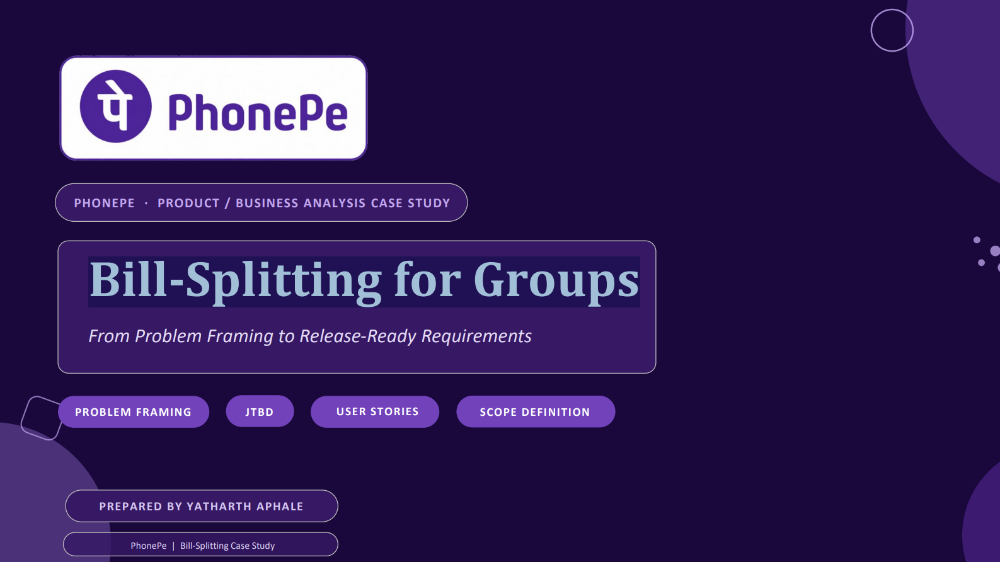

#  PhonePe — Bill-Splitting for Groups (Case Study)

A product/business-analysis case study on scoping a **group bill-splitting feature** for PhonePe (500M+ registered users) — starting from a messy, mid-flight team brief and working through to a release-ready, stakeholder-aligned MVP scope.

---

## 📌 The Brief

PhonePe greenlit a bill-splitting feature for urban users who share recurring group expenses (rent, trips, dining) — but the team walked in with:

- Three product teams holding three different definitions of "bill splitting"
- An unresolved compliance flag on UPI transaction limits for multi-recipient requests
- No documented problem statement or target user
- A junior PM already drafting user stories before requirements existed
- Engineering asking for a scope boundary ahead of sprint planning

**The task:** frame the problem properly, translate it into requirements, audit and rewrite the junior PM's draft stories, write three release-ready stories with full acceptance criteria, and draw a defensible scope line — with every downstream decision traceable back to the original problem statement.

---

## 🔍 Approach

<b>1. Problem Framing</b>

- **5W1H investigation** — who faces the problem, what's broken, when it recurs, where it currently happens (WhatsApp, Splitwise, mental math), why, and what's still unquantified
- A **SMART problem statement**: specific, measurable, impact-focused
- A **How Might We** to reopen the design space before requirements narrow it back down
- **Jobs To Be Done** across functional, emotional, and social dimensions
- **Root cause analysis (5 Whys)** — traced the real constraint back to UPI's per-transaction/per-day limits, not a UX gap

<b>2. Requirements Translation</b>

Split the validated problem into three layers:
- **Business (why):** the outcome PhonePe is buying — engagement and retention, no feature names or UI
- **Functional (what):** the six capabilities the feature must deliver
- **Product (how):** the actual tap-by-tap flow, including UPI-limit-aware request handling

<b>3. Story Quality Control</b>

Audited the junior PM's two draft stories against **INVEST**:
- Story 1 ("split bills so it is easier") — failed 5 of 6 criteria; too abstract to size or test
- Story 2 (a 6-capability wish-list disguised as one story) — an Epic wearing a Story's clothing

Both were rewritten — Story 1 split into two INVEST-compliant stories, Story 2 broken into a proper Epic with MVP vs. Release 2+ backlog.

<b>4. New User Stories + Acceptance Criteria</b>

Three release-ready stories, each with **Happy Path / Sad Path / Edge Case** Given-When-Then acceptance criteria covering:
- Splitting and requesting in one action
- Receiving and paying a request within the app
- Real-time paid/pending status and settlement

<b>5. Scope Definition</b>

- Mapped every stakeholder's stated position to their real underlying need
- Defined **Release 1 (MVP)** — the complete, testable "split → request → track → settle" loop
- Defined what's deliberately **out of scope** (unequal splits, partial payments, automated reminders, recurring scheduling, UPI history sync, cross-group/multi-currency) and why
- Applied a single scope test throughout: *does this capability directly serve the core loop for a one-time group expense?*

---

## 🧰 Frameworks Used

`5W1H` · `SMART Problem Statements` · `How Might We` · `Jobs To Be Done` · `5 Whys Root Cause Analysis` · `Business/Functional/Product Requirements` · `INVEST` · `Given-When-Then Acceptance Criteria` · `Stakeholder Alignment Mapping` · `MVP Scope Definition`

---

## 📄 What's Inside

| Slide Range | Section |
|---|---|
| 1–2 | Cover + Deck Overview + Case Background |
| 3–7 | Part 1 — Problem Framing (5W1H → Statement → HMW → JTBD → Root Cause) |
| 8 | Part 2 — Requirements Translation |
| 9–12 | Part 3 — Story Quality Control (Critique + Rewrite) |
| 13–15 | Part 4 — New User Stories + Acceptance Criteria |
| 16–19 | Part 5 — Scope Definition |
| 20 | Closing — Reasoning Chain Summary |

📎 Full deck: [`PhonePe_Bill_Splitting_Case_Study.pdf`](./PhonePe_Bill_Splitting_Case_Study.pdf)

---

## 👤 About

Built by **Yatharth Aphale** as part of a hands-on **Business & Data Analytics Portfolio**.

*⭐ If you found this useful, drop a star — it helps others discover the project!*

